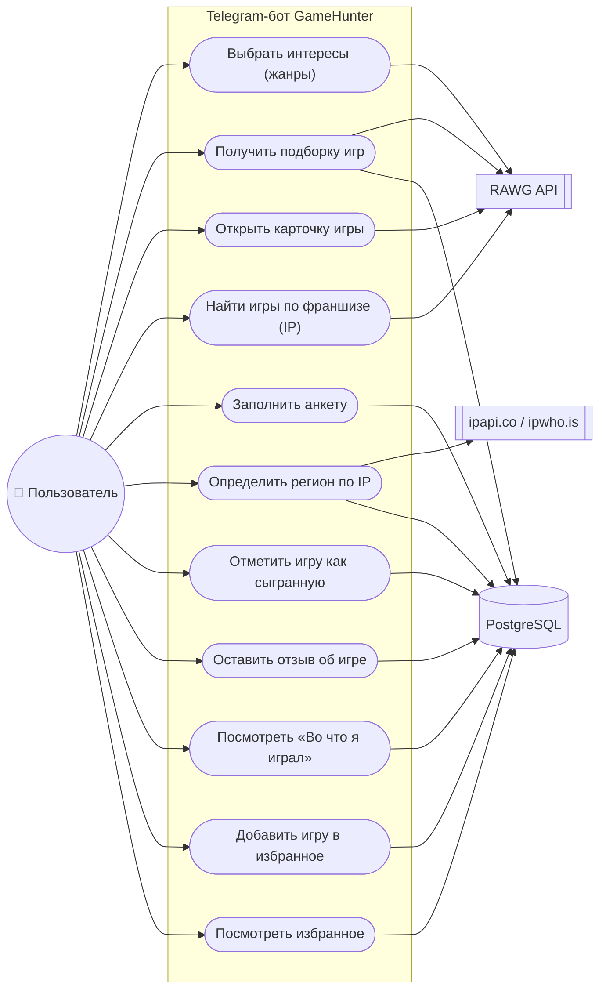

# 02. Сценарии использования (Use Case)

Бот GameHunter — это диалоговый помощник для поиска видеоигр. Ниже описаны
акторы, диаграмма вариантов использования и пошаговые сценарии.

## Акторы

| Актор | Описание |
|-------|----------|
| **Пользователь** | человек, который ищет игру по интересам в Telegram |
| **RAWG Video Games Database** | внешний каталог видеоигр: жанры, платформы, игры, франшизы (вторичный актор) |
| **Сервис геолокации по IP** | ipapi.co (или ipwho.is): город, страна, часовой пояс, валюта (вторичный актор) |
| **База данных PostgreSQL** | хранилище анкеты, сыгранных игр, отзывов и избранного (вторичный актор) |

## Use Case диаграмма

Диаграмма в формате DrawIO: [diagrams/use_case.drawio](diagrams/use_case.drawio).

## Детализация сценариев

### Сценарий 1. Подбор игры по интересам (жанрам)

| Шаг | Действие |
|-----|----------|
| 1 | Пользователь нажимает «Подобрать игру» в главном меню |
| 2 | Бот запрашивает у RAWG список жанров (`GET /genres`) и показывает не более 12 вариантов |
| 3 | Пользователь отмечает жанры кнопками (отмеченные помечаются «✔»), можно несколько |
| 4 | Пользователь нажимает «Показать подборку» |
| 5 | Бот запрашивает игры (`GET /games`) с фильтрами `genres`, `parent_platforms`, `ordering=-rating`, `page_size=5` |
| 6 | Бот исключает игры, которые пользователь уже отметил как сыгранные (`exclude_games`) |
| 7 | Пользователь видит список игр: название, год выхода, рейтинг, первый жанр + кнопки выбора |
| 3а | Пользователь не выбрал жанры → берутся интересы из анкеты; если и их нет → сообщение «Выберите хотя бы один жанр…» |
| 3б | Пользователь нажимает «Показать всё» → подборка без фильтра по жанрам |
| 5а | Игр не найдено → «По выбранным критериям игр не найдено…» + кнопки «Другие жанры» и «В главное меню» |
| 5б | RAWG недоступен → «Не удалось получить список игр. Попробуйте ещё раз позже.» |
| 7а | Игр больше одной страницы → кнопки «Назад» / «Вперёд» |

### Сценарий 2. Карточка игры

| Шаг | Действие |
|-----|----------|
| 1 | Пользователь нажимает «Выбрать игру N» |
| 2 | Бот запрашивает детали игры (`GET /games/{id}`) и определяет возрастной рейтинг (ESRB / PEGI) |
| 3 | Бот показывает карточку: название, дата выхода, рейтинг, Metacritic, жанры, платформы, возрастной рейтинг, разработчик, издатель, время прохождения, магазины, метки, описание (до 400 символов) и обложку |
| 4 | Если регион определён в анкете, в карточке показывается строка «Ваш регион: …, валюта …» |
| 5 | Пользователь нажимает «Уже играл», «В избранное» или «Назад» |
| 2а | Игра не найдена в каталоге → «Игра не найдена. Вернитесь к списку и выберите игру заново.» |
| 3а | Обложки нет или Telegram не принял фото → карточка отправляется текстом |
| 5а | Игра уже отмечена как сыгранная → «Эта игра уже есть в Вашем списке «Во что я играл».» |

### Сценарий 3. Поиск игр по франшизе (IP)

| Шаг | Действие |
|-----|----------|
| 1 | Пользователь нажимает «Игры по франшизе» |
| 2 | Бот просит ввести название франшизы (Marvel, Star Wars, Warcraft) и скрывает обычную клавиатуру |
| 3 | Пользователь отправляет название сообщением |
| 4 | Бот ищет франшизы (`GET /franchises?search=…&ordering=-games_count`) и показывает до 5 результатов с числом игр |
| 5 | Пользователь выбирает франшизу кнопкой |
| 6 | Бот запрашивает игры франшизы (`GET /franchises/{id}`) и показывает список |
| 7 | Пользователь открывает карточку игры (дальше — Сценарий 2) |
| 3а | Пустое сообщение → «Введите название франшизы, например: Marvel.» и повторный ввод |
| 4а | Франшиза не найдена → «Франшиза не найдена. Проверьте название…» + кнопка «Другая франшиза» |
| 6а | У франшизы нет списка игр → бот ищет игры по названию франшизы (`GET /games?search=…`) |
| 4б | RAWG недоступен → «Не удалось выполнить поиск по франшизе. Попробуйте ещё раз позже.» |

### Сценарий 4. Заполнение анкеты

| Шаг | Действие |
|-----|----------|
| 1 | Пользователь нажимает «Моя анкета» |
| 2 | Бот показывает анкету: возраст, интересы, платформы, регион, число пройденных игр |
| 3 | Пользователь нажимает «Указать возраст» и отправляет число |
| 4 | Бот проверяет возраст (3–120) и сохраняет его в таблице `user_profiles` |
| 5 | Пользователь нажимает «Выбрать интересы», отмечает жанры и нажимает «Сохранить» |
| 6 | Пользователь нажимает «Выбрать платформы», отмечает платформы и нажимает «Сохранить» |
| 7 | Анкета используется как фильтр по умолчанию при подборе игр |
| 3а | Возраст не число или вне диапазона → «Возраст должен быть числом от 3 до 120. Попробуйте ещё раз.» и повторный ввод |
| 5а | Жанры не выбраны → в подборке не будет фильтра по жанрам |
| 2а | База данных недоступна → «Ошибка при работе с базой данных. Попробуйте ещё раз позже.» |

### Сценарий 5. Определение региона по IP-адресу

| Шаг | Действие |
|-----|----------|
| 1 | Пользователь нажимает «Определить регион по IP» в анкете |
| 2 | Бот объясняет, что Telegram не передаёт IP, и просит прислать публичный адрес (например, с сайта 2ip.ru) |
| 3 | Пользователь отправляет IP-адрес сообщением (адрес выделяется из текста регулярным выражением) |
| 4 | Бот проверяет адрес: формат и что он не локальный (10.x, 192.168.x, 127.x, ::1) |
| 5 | Бот запрашивает сервис геолокации (`GET https://ipapi.co/{ip}/json/`) |
| 6 | Бот сохраняет город, страну, часовой пояс, валюту, координаты и сам адрес в анкету |
| 7 | Пользователь видит анкету с определённым регионом |
| 4а | Некорректный адрес → «Некорректный IP-адрес. Пример правильного адреса: 8.8.8.8…» и повторный ввод |
| 4б | Локальный адрес → «Это локальный (внутренний) IP-адрес — по нему нельзя определить регион…» |
| 5а | Сервис недоступен или превышен лимит → «Не удалось определить регион по IP-адресу…» |
| 6а | Пользователь нажимает «Убрать регион» → данные региона удаляются из анкеты |

### Сценарий 6. Отметка «Уже играл» и учёт сыгранных игр

| Шаг | Действие |
|-----|----------|
| 1 | В карточке игры пользователь нажимает «Уже играл» |
| 2 | Бот создаёт запись в таблице `played_games`: `tg_user_id`, `game_id`, `slug`, `name`, `image_url`, `played_at` = сейчас |
| 3 | Бот подтверждает: «Игра добавлена в список «Во что я играл».» |
| 4 | При следующем подборе бот передаёт идентификаторы сыгранных игр в параметр `exclude_games` |
| 5 | В списке подборки появляется строка «Игры, в которые Вы уже играли, исключены из подборки.» |
| 2а | Игра уже есть в списке → «Эта игра уже есть в Вашем списке «Во что я играл».» |
| 2б | База данных недоступна → сообщение об ошибке, игра не добавляется |

### Сценарий 7. Просмотр истории и отзыв об игре

| Шаг | Действие |
|-----|----------|
| 1 | Пользователь нажимает «Во что я играл» |
| 2 | Бот показывает список записей по 5 на странице: дата добавления и название игры |
| 3 | Пользователь выбирает запись кнопкой |
| 4 | Бот показывает информацию: дата добавления, игра, отзыв (или «Отзыв об игре отсутствует.») |
| 5 | Пользователь нажимает «Написать отзыв» и отправляет текст |
| 6 | Бот проверяет длину (не более 1000 символов) и сохраняет отзыв |
| 7 | Пользователь снова видит информацию об игре уже с отзывом |
| 2а | Список пуст → «Список пока пуст. Откройте карточку любой игры и нажмите «Уже играл».» |
| 5а | Отзыв длиннее 1000 символов → «Отзыв не должен превышать 1000 символов…» и повторный ввод |
| 5б | Пустое сообщение → «Отзыв не может быть пустым…» |
| 4а | Пользователь нажимает «Удалить из списка» → запись удаляется, бот возвращает в список |

### Сценарий 8. Избранное

| Шаг | Действие |
|-----|----------|
| 1 | В карточке игры пользователь нажимает «В избранное» |
| 2 | Бот создаёт запись в таблице `favorite_games` и подтверждает добавление |
| 3 | Кнопка в карточке меняется на «Убрать из избранного», появляется строка «★ Игра в избранном.» |
| 4 | Пользователь нажимает «Избранное» в главном меню и видит список по 5 на странице |
| 5 | Пользователь выбирает игру и переходит в её карточку |
| 2а | Игра уже в избранном → нажатие кнопки убирает её (переключение) |
| 4а | Избранное пусто → «В избранном пока нет игр…» |

### Сценарий 9. Поведение бота при ошибках

| Шаг | Действие |
|-----|----------|
| 1 | Любой сценарий: внешний сервис или база данных отвечают с ошибкой |
| 2 | Инфраструктурный клиент преобразует ошибку в доменное исключение (`GamesUnavailableError`, `RegionUnavailableError`, `DatabaseError` и др.) |
| 3 | Декоратор `safe_handler` перехватывает исключение и отправляет пользователю `user_message` |
| 4 | Бот пишет ошибку в лог (с контекстом: экран, пользователь, сервис) и продолжает принимать апдейты |
| 5 | Пользователь может повторить действие или вернуться в главное меню кнопкой |
| 4а | Неожиданная ошибка (не доменное исключение) → «Произошла ошибка. Попробуйте ещё раз позже.» |

## Альтернативные потоки: что происходит при первом запуске

| Ситуация | Поведение |
|----------|-----------|
| Пользователь впервые пишет боту | Показывается Экран 1 «Приветствие» с кнопкой «Старт» |
| Пользователь отправляет `/start` в любой момент | Показывается главное меню, контекст сбрасывается |
| Пользователь отправляет произвольный текст не в режиме ввода | «Я понимаю только кнопки и команды меню…» |
| Пользователь присылает фото, голосовое, стикер | Сообщение игнорируется (без ответа), чтобы не мешать диалогу |
| Пользователь нажимает кнопку из устаревшего сообщения | Если данных шага уже нет: «Данные предыдущего шага не сохранились…» + возврат в главное меню |
