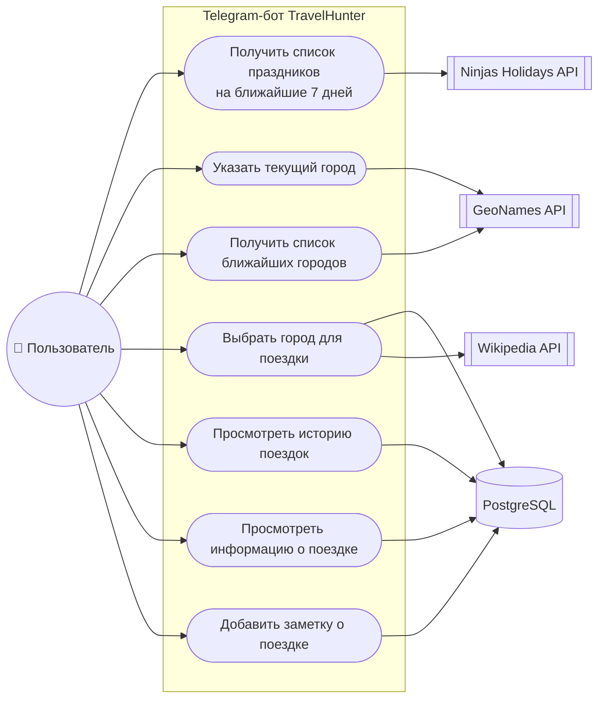

# 02. Сценарии использования (Use Case)

Пользователь взаимодействует с Telegram-ботом через команды, кнопки и текстовые сообщения.

## Акторы

| Актор | Описание |
|-------|----------|
| **Пользователь** | человек, который подбирает путешествие выходного дня в Telegram |
| **Ninjas Holidays API** | внешний сервис со списком праздников (вторичный актор) |
| **GeoNames API** | внешний сервис географических названий (вторичный актор) |
| **Wikipedia API** | внешний сервис с описанием и изображением города (вторичный актор) |
| **База данных PostgreSQL** | хранилище поездок и заметок (вторичный актор) |

## Use Case диаграмма

Диаграмма в формате DrawIO: [diagrams/use_case.drawio](diagrams/use_case.drawio).

## Детализация сценариев

### Сценарий 1. Получение списка праздников на ближайшие 7 дней

| Шаг | Действие |
|-----|----------|
| 1 | Пользователь нажимает кнопку «Праздники на 7 дней» в главном меню |
| 2 | Бот запрашивает праздники страны `RU` у Ninjas Holidays API (`X-Api-Key`) |
| 3 | Бот оставляет праздники в диапазоне [сегодня; сегодня + 7 дней] |
| 4 | Бот показывает не более 5 праздников: название, дата, тип |
| 5а | Праздников нет → «К сожалению, ни одного праздника не найдено…» |
| 5б | API недоступен → «Не удалось получить список праздников. Попробуйте ещё раз позже.» |
| 6 | Пользователь нажимает «В главное меню» |

**Код:** `HolidaysScreen.show()` → `HolidayService.get_upcoming_holidays()` → `NinjasHolidaysClient.fetch_holidays()`.

### Сценарий 2. Получение списка ближайших городов

| Шаг | Действие |
|-----|----------|
| 1 | Пользователь нажимает «Города куда съездить» |
| 2 | Бот просит ввести название текущего города |
| 3 | Пользователь вводит название города |
| 4 | Бот проверяет город через GeoNames `searchJSON` и сохраняет название, `lat`, `lng` |
| 5 | Бот запрашивает GeoNames `findNearbyPlaceNameJSON` с радиусом 500 км |
| 6 | Бот исключает город пользователя, убирает дубликаты и берёт первые 5 городов |
| 7 | Пользователь видит список «Название города — расстояние км» и кнопки выбора |
| 4а | Город не найден → сообщение об ошибке и повторный ввод |
| 6а | Других городов рядом нет → сообщение об ошибке и возврат в главное меню |

**Код:** `CityInputScreen` → `CityService.find_city()` → `NearbyCitiesScreen` → `CityService.find_nearby_cities()`.

### Сценарий 3. Выбор города для поездки

| Шаг | Действие |
|-----|----------|
| 1 | Пользователь нажимает «Выбрать город N» |
| 2 | Бот определяет выбранный город из сохранённого списка |
| 3 | Бот создаёт запись в таблице `visited_cities`: `tg_user_id`, `name`, `arrival_date` = текущая дата |
| 4 | Бот запрашивает описание и изображение города в Wikipedia API (`extracts`, `pageimages`) |
| 5 | Пользователь видит изображение, название и краткое описание города |
| 4а | Изображения нет → информация показывается текстом |
| 4б | Wikipedia недоступна → сообщение об ошибке + кнопка «В главное меню» (поездка уже сохранена) |

**Код:** `CityInfoScreen.show()` → `TripService.create_trip()` + `CityService.get_city_info()`.

### Сценарий 4. Просмотр истории поездок

| Шаг | Действие |
|-----|----------|
| 1 | Пользователь нажимает «История поездок» |
| 2 | Бот выбирает из базы записи, где `tg_user_id` = Telegram ID пользователя |
| 3 | Поездки сортируются от новых к старым, показываются по 5 на странице |
| 4 | Пользователь видит дату поездки и название города + кнопки выбора |
| 5 | Если поездок больше 5 — доступны кнопки «Назад» и «Вперёд» |
| 3а | История пуста → «История поездок пока пуста…» и только кнопка «В главное меню» |

**Код:** `HistoryScreen.show()` → `TripService.get_history()` → `SqlTripRepository.page_by_user()`.

### Сценарий 5. Просмотр информации о поездке

| Шаг | Действие |
|-----|----------|
| 1 | Пользователь выбирает поездку в истории |
| 2 | Бот показывает дату поездки, название города и заметку |
| 2а | Заметки нет → «Заметка о поездке отсутствует.» |
| 3 | Доступны кнопки «Написать заметку», «Назад», «В главное меню» |

**Код:** `TripInfoScreen.show()` → `TripService.get_trip()`.

### Сценарий 6. Добавление заметки о поездке

| Шаг | Действие |
|-----|----------|
| 1 | Пользователь нажимает «Написать заметку» |
| 2 | Бот просит ввести текст заметки |
| 3 | Пользователь отправляет текст |
| 4 | Бот сохраняет заметку в поле `note` и пишет «Заметка успешно сохранена.» |
| 5 | Пользователь возвращается к информации о поездке — уже с заметкой |
| 3а | Текст длиннее 1000 символов → заметка не сохраняется, бот ждёт повторного ввода |
| 3б | Пустой текст → заметка не сохраняется, бот ждёт повторного ввода |

**Код:** `NoteInputScreen.show()` / `NoteInputScreen.save()` → `TripService.add_note()`.

## Прецеденты, общие для всех сценариев

| Прецедент | Поведение бота |
|-----------|----------------|
| Команда `/start` | Возвращает в главное меню с любого экрана (при первом запуске показывает Экран 1) |
| Произвольный текст в меню | «Нераспознанная команда. Пожалуйста, нажмите выбранную кнопку в меню.» |
| Изображение, файл, голосовое, видео | Сообщение игнорируется, бот не выполняет никаких действий |
| Сбой внешнего сервиса или базы данных | Пользователь получает сообщение об ошибке, бот продолжает работу |
| Перезапуск бота во время диалога | «Данные предыдущего шага не сохранились…» + возврат в главное меню |
