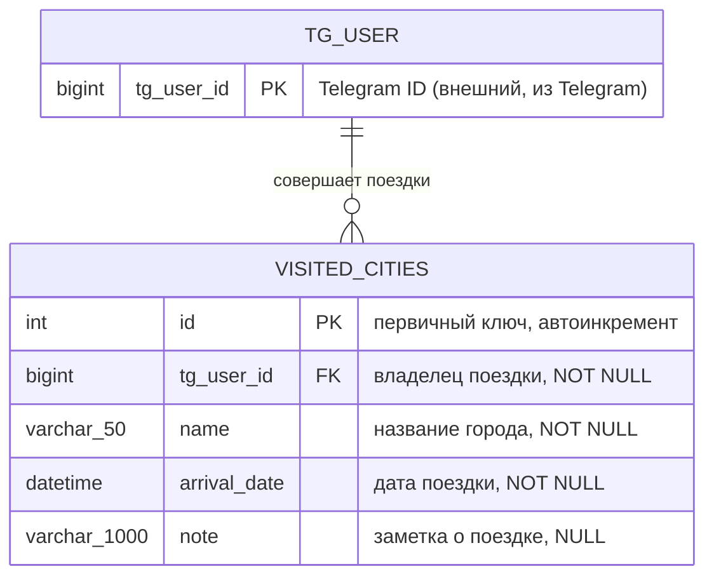

# 03. Структура данных в проекте

Для хранения информации о поездках пользователя используется реляционная база данных
(PostgreSQL). Доступ к данным выполняется только через SQLAlchemy ORM.

## Таблица `visited_cities`

Таблица хранит информацию о поездках пользователей Telegram-бота.

| Поле | Тип | Ограничения | Описание |
|------|-----|-------------|----------|
| `id` | `int` (SERIAL) | PRIMARY KEY, autoincrement | Первичный ключ, генерируется автоматически |
| `tg_user_id` | `bigint` | NOT NULL | Telegram ID пользователя — владельца поездки |
| `name` | `varchar(50)` | NOT NULL | Название города, выбранного пользователем |
| `arrival_date` | `datetime` | NOT NULL | Дата поездки; при создании записывается текущая дата |
| `note` | `varchar(1000)` | NULL | Заметка пользователя о поездке (может отсутствовать) |

Индекс `ix_visited_cities_user_date (tg_user_id, arrival_date)` ускоряет основной
запрос экрана «История поездок»: выборка поездок пользователя от новых к старым.

## SQL-схема (PostgreSQL)

```sql
CREATE TABLE visited_cities (
    id           SERIAL PRIMARY KEY,
    tg_user_id   BIGINT        NOT NULL,
    name         VARCHAR(50)   NOT NULL,
    arrival_date TIMESTAMP     NOT NULL,
    note         VARCHAR(1000) NULL
);

CREATE INDEX ix_visited_cities_user_date ON visited_cities (tg_user_id, arrival_date);
```

Схема создаётся автоматически из ORM-модели (`Base.metadata.create_all`),
поэтому вручную выполнять SQL не требуется:

```bash
python -m scripts.init_db          # только создать таблицы
python -m scripts.init_db --demo   # создать таблицы + 6 демонстрационных поездок
```

## ER-диаграмма



Пользователь Telegram не хранится отдельной таблицей: он идентифицируется полем
`tg_user_id`, а связь «один пользователь — много поездок» реализуется через это поле.

Диаграмма в формате DrawIO: [diagrams/er_diagram.drawio](diagrams/er_diagram.drawio).

## ORM-модель (SQLAlchemy 2.0)

`travelhunter/infrastructure/db/models.py`:

```python
class VisitedCityORM(Base):
    __tablename__ = "visited_cities"

    id: Mapped[int] = mapped_column(Integer, primary_key=True, autoincrement=True)
    tg_user_id: Mapped[int] = mapped_column(BigInteger, nullable=False)
    name: Mapped[str] = mapped_column(String(50), nullable=False)
    arrival_date: Mapped[datetime] = mapped_column(DateTime, nullable=False, default=datetime.now)
    note: Mapped[Optional[str]] = mapped_column(String(1000), nullable=True)

    __table_args__ = (Index("ix_visited_cities_user_date", "tg_user_id", "arrival_date"),)
```

## Доменная сущность `Trip`

ORM-строки не «выходят» за пределы слоя инфраструктуры: репозиторий преобразует их
в доменную сущность `Trip` (`travelhunter/domain/entities.py`), с которой работают
сервисы и экраны.

```python
@dataclass(frozen=True)
class Trip:
    id: int
    tg_user_id: int
    name: str
    arrival_date: datetime
    note: Optional[str] = None
```

## Операции с данными

| Операция | Метод репозитория | Кто вызывает |
|----------|-------------------|--------------|
| Создать поездку | `add(tg_user_id, city_name, arrival_date)` | `TripService.create_trip()` → Экран 6 |
| История (страница) | `page_by_user(tg_user_id, page, page_size)` | `TripService.get_history()` → Экран 7 |
| Поездки списком | `find_by_user(tg_user_id, limit, offset)` | `page_by_user()` |
| Количество поездок | `count_by_user(tg_user_id)` | `page_by_user()` (расчёт числа страниц) |
| Информация о поездке | `find_by_id(trip_id, tg_user_id)` | `TripService.get_trip()` → Экран 8 |
| Сохранить заметку | `update_note(trip_id, tg_user_id, note)` | `TripService.add_note()` → Экран 9 |

Все методы проверяют `tg_user_id`, поэтому пользователь не может прочитать или
изменить чужую поездку.

## Транзакции и ошибки

* каждая операция выполняется в своей сессии через контекст `Database.session_scope()`:
  при успехе — `commit`, при ошибке — `rollback`, сессия всегда закрывается;
* ошибки SQLAlchemy преобразуются в доменное исключение `DatabaseError`;
* экран показывает пользователю сообщение «Ошибка при работе с базой данных.
  Попробуйте ещё раз позже.» — бот при этом продолжает работу.
