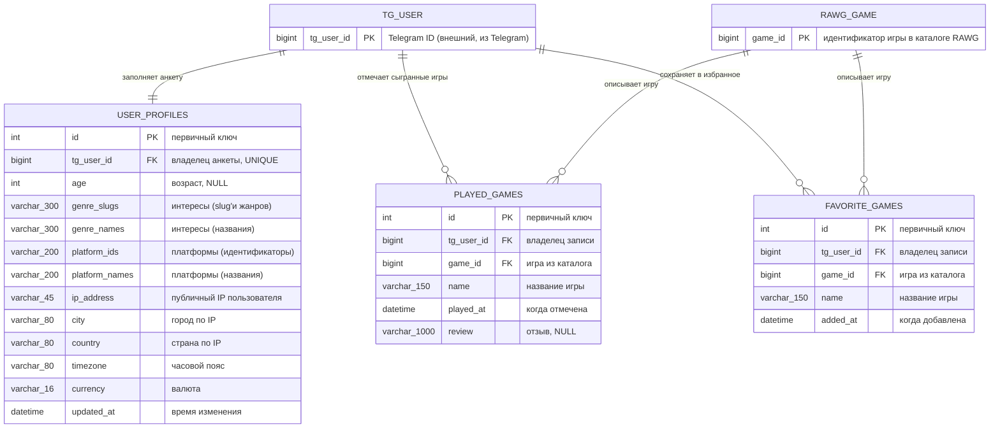

# 03. Структура данных в проекте

Для хранения анкеты, сыгранных игр и избранного используется реляционная база
данных (PostgreSQL). Доступ к данным выполняется только через SQLAlchemy ORM
(стиль 2.0: `DeclarativeBase`, `Mapped`, `mapped_column`).

В проекте три таблицы. Во всех есть поле `tg_user_id` — Telegram ID владельца
данных, поэтому каждый пользователь видит и изменяет только свои записи.

## Таблица `user_profiles` — анкета пользователя

Одна строка на пользователя: возраст, интересы, платформы и регион по IP.

| Поле | Тип | Ограничения | Описание |
|------|-----|-------------|----------|
| `id` | `int` (SERIAL) | PRIMARY KEY, autoincrement | Первичный ключ |
| `tg_user_id` | `bigint` | NOT NULL, UNIQUE, индекс | Telegram ID пользователя |
| `age` | `int` | NULL | Возраст (3–120); используется для возрастного фильтра |
| `genre_slugs` | `varchar(300)` | NOT NULL, default `''` | Slug'и жанров через запятую — для запросов к каталогу |
| `genre_names` | `varchar(300)` | NOT NULL, default `''` | Названия жанров через запятую — для показа пользователю |
| `platform_ids` | `varchar(200)` | NOT NULL, default `''` | Идентификаторы родительских платформ через запятую |
| `platform_names` | `varchar(200)` | NOT NULL, default `''` | Названия платформ через запятую |
| `ip_address` | `varchar(45)` | NULL | Публичный IP-адрес, присланный пользователем (IPv4/IPv6) |
| `country` | `varchar(80)` | NULL | Страна |
| `country_code` | `varchar(8)` | NULL | Код страны (RU, US, …) |
| `city` | `varchar(80)` | NULL | Город |
| `region_name` | `varchar(80)` | NULL | Регион/штат/область |
| `timezone` | `varchar(80)` | NULL | Часовой пояс (Europe/Moscow) |
| `currency` | `varchar(16)` | NULL | Валюта региона (RUB, USD) |
| `latitude` | `float` | NULL | Широта |
| `longitude` | `float` | NULL | Долгота |
| `updated_at` | `datetime` | NOT NULL | Время последнего изменения анкеты |

Списки жанров и платформ хранятся строкой через запятую намеренно: это простые
справочные значения без отдельных сущностей, и такое хранение позволяет обойтись
без двух дополнительных таблиц связей. Преобразование «строка ↔ кортеж»
выполняется в репозитории (`_join`, `_split_str`, `_split_int`), поэтому домен
работает только с кортежами.

## Таблица `played_games` — «во что я уже играл»

| Поле | Тип | Ограничения | Описание |
|------|-----|-------------|----------|
| `id` | `int` (SERIAL) | PRIMARY KEY, autoincrement | Первичный ключ |
| `tg_user_id` | `bigint` | NOT NULL | Telegram ID пользователя |
| `game_id` | `bigint` | NOT NULL | Идентификатор игры в каталоге RAWG |
| `slug` | `varchar(150)` | NOT NULL, default `''` | Slug игры (для ссылок и отладки) |
| `name` | `varchar(150)` | NOT NULL | Название игры на момент добавления |
| `image_url` | `varchar(500)` | NULL | Ссылка на обложку |
| `played_at` | `datetime` | NOT NULL | Когда пользователь отметил игру |
| `review` | `varchar(1000)` | NULL | Отзыв пользователя (не более 1000 символов) |

Ограничение `uq_played_games_user_game (tg_user_id, game_id)` не даёт добавить
одну и ту же игру дважды. Индекс `ix_played_games_user_date (tg_user_id, played_at)`
ускоряет основной запрос экрана «Во что я играл» (выборка от новых к старым).

## Таблица `favorite_games` — избранное

| Поле | Тип | Ограничения | Описание |
|------|-----|-------------|----------|
| `id` | `int` (SERIAL) | PRIMARY KEY, autoincrement | Первичный ключ |
| `tg_user_id` | `bigint` | NOT NULL | Telegram ID пользователя |
| `game_id` | `bigint` | NOT NULL | Идентификатор игры в каталоге RAWG |
| `slug` | `varchar(150)` | NOT NULL, default `''` | Slug игры |
| `name` | `varchar(150)` | NOT NULL | Название игры |
| `image_url` | `varchar(500)` | NULL | Ссылка на обложку |
| `added_at` | `datetime` | NOT NULL | Когда игра добавлена в избранное |

Ограничение `uq_favorite_games_user_game (tg_user_id, game_id)` и индекс
`ix_favorite_games_user_date (tg_user_id, added_at)` — по той же причине.

## SQL-схема (PostgreSQL)

```sql
CREATE TABLE user_profiles (
    id             SERIAL PRIMARY KEY,
    tg_user_id     BIGINT       NOT NULL UNIQUE,
    age            INTEGER      NULL,
    genre_slugs    VARCHAR(300) NOT NULL DEFAULT '',
    genre_names    VARCHAR(300) NOT NULL DEFAULT '',
    platform_ids   VARCHAR(200) NOT NULL DEFAULT '',
    platform_names VARCHAR(200) NOT NULL DEFAULT '',
    ip_address     VARCHAR(45)  NULL,
    country        VARCHAR(80)  NULL,
    country_code   VARCHAR(8)   NULL,
    city           VARCHAR(80)  NULL,
    region_name    VARCHAR(80)  NULL,
    timezone       VARCHAR(80)  NULL,
    currency       VARCHAR(16)  NULL,
    latitude       FLOAT        NULL,
    longitude      FLOAT        NULL,
    updated_at     TIMESTAMP    NOT NULL
);

CREATE INDEX ix_user_profiles_tg_user_id ON user_profiles (tg_user_id);

CREATE TABLE played_games (
    id         SERIAL PRIMARY KEY,
    tg_user_id BIGINT        NOT NULL,
    game_id    BIGINT        NOT NULL,
    slug       VARCHAR(150)  NOT NULL DEFAULT '',
    name       VARCHAR(150)  NOT NULL,
    image_url  VARCHAR(500)  NULL,
    played_at  TIMESTAMP     NOT NULL,
    review     VARCHAR(1000) NULL,
    CONSTRAINT uq_played_games_user_game UNIQUE (tg_user_id, game_id)
);

CREATE INDEX ix_played_games_user_date ON played_games (tg_user_id, played_at);

CREATE TABLE favorite_games (
    id         SERIAL PRIMARY KEY,
    tg_user_id BIGINT       NOT NULL,
    game_id    BIGINT       NOT NULL,
    slug       VARCHAR(150) NOT NULL DEFAULT '',
    name       VARCHAR(150) NOT NULL,
    image_url  VARCHAR(500) NULL,
    added_at   TIMESTAMP    NOT NULL,
    CONSTRAINT uq_favorite_games_user_game UNIQUE (tg_user_id, game_id)
);

CREATE INDEX ix_favorite_games_user_date ON favorite_games (tg_user_id, added_at);
```

Схема создаётся автоматически из ORM-моделей (`Base.metadata.create_all`),
поэтому вручную выполнять SQL не требуется:

```bash
python -m scripts.init_db          # только создать таблицы
python -m scripts.init_db --demo   # создать таблицы + демо-анкету, 3 сыгранные игры и 2 избранные
```

## ER-диаграмма



Пользователь Telegram и игра каталога не хранятся отдельными таблицами: они
идентифицируются полями `tg_user_id` и `game_id`, а связи «один пользователь —
много записей» и «одна игра — много записей у разных пользователей» реализуются
через эти поля.

Диаграмма в формате DrawIO: [diagrams/er_diagram.drawio](diagrams/er_diagram.drawio).

## ORM-модель (SQLAlchemy 2.0)

`gamehunter/infrastructure/db/models.py` (фрагмент):

```python
class PlayedGameORM(Base):
    """Запись «во что я уже играл» с отзывом пользователя."""

    __tablename__ = "played_games"

    id: Mapped[int] = mapped_column(Integer, primary_key=True, autoincrement=True)
    tg_user_id: Mapped[int] = mapped_column(BigInteger, nullable=False)
    game_id: Mapped[int] = mapped_column(BigInteger, nullable=False)
    slug: Mapped[str] = mapped_column(String(150), nullable=False, default="")
    name: Mapped[str] = mapped_column(String(150), nullable=False)
    image_url: Mapped[Optional[str]] = mapped_column(String(500), nullable=True)
    played_at: Mapped[datetime] = mapped_column(DateTime, nullable=False, default=datetime.now)
    review: Mapped[Optional[str]] = mapped_column(String(1000), nullable=True)

    __table_args__ = (
        UniqueConstraint("tg_user_id", "game_id", name="uq_played_games_user_game"),
        Index("ix_played_games_user_date", "tg_user_id", "played_at"),
    )
```

## Доменные сущности

`gamehunter/domain/entities.py` — неизменяемые dataclass'ы, с которыми работает
бизнес-логика. Они не знают ни про SQLAlchemy, ни про Telegram:

| Сущность | Назначение | Ключевые поля и свойства |
|----------|------------|--------------------------|
| `Genre` | жанр (интерес) | `id`, `name`, `slug`, `games_count` |
| `Platform` | платформа | `id`, `name`, `slug`, `is_parent` |
| `Game` | игра из списка | `id`, `slug`, `name`, `released`, `rating`, `genres`, `platforms`, `metacritic`, `playtime_hours`, `image_url`; свойства `release_year`, `formatted_released`, `formatted_rating`, `genres_text`, `platforms_text`, `has_image` |
| `GameDetails` | карточка игры | `game`, `summary`, `min_age`, `age_rating_label`, `developers`, `publishers`, `stores`, `tags`; свойства `name`, `game_id`, `image_url`, `has_image`, `formatted_age` |
| `Franchise` | франшиза (IP) | `id`, `name`, `slug`, `games_count`, `games` |
| `Region` | регион по IP | `ip`, `city`, `region_name`, `country`, `country_code`, `timezone`, `currency`, `latitude`, `longitude`; свойства `title`, `is_known` |
| `UserProfile` | анкета | `tg_user_id`, `age`, `genre_slugs`, `genre_names`, `platform_ids`, `platform_names`, `region`, `updated_at`; свойства `interests_text`, `platforms_text`; методы `with_age`, `with_genres`, `with_platforms`, `with_region` |
| `PlayedGame` | запись «играл» | `id`, `tg_user_id`, `game_id`, `slug`, `name`, `played_at`, `review`, `image_url`; свойства `formatted_date`, `has_review` |
| `FavoriteGame` | запись избранного | `id`, `tg_user_id`, `game_id`, `slug`, `name`, `added_at`, `image_url`; свойство `formatted_date` |
| `GameQuery` | параметры поиска | `genres`, `parent_platforms`, `search`, `page`, `page_size`, `ordering`, `exclude_game_ids`, `exclude_additions`; свойство `is_empty`, метод `with_page` |
| `GamePage` | страница подборки | `games`, `page`, `page_size`, `total_count`, `has_next`, `has_previous`; свойства `total_pages`, `is_empty` |
| `LibraryPage[T]` | страница библиотеки | `items`, `page`, `total_pages`; свойства `is_empty`, `has_next`, `has_previous` |

Все запросы обязательно фильтруются по `tg_user_id`: получить чужую запись
по идентификатору невозможно.

## Транзакции и ошибки

* Каждая операция выполняется в своей транзакции через контекстный менеджер
  `Database.session_scope()`: при успехе — `commit`, при исключении — `rollback`.
* Любая ошибка SQLAlchemy (`SQLAlchemyError`, включая `IntegrityError`)
  преобразуется в доменное исключение `DatabaseError` с готовым текстом
  «Ошибка при работе с базой данных. Попробуйте ещё раз позже.»; исходная ошибка
  пишется в лог.
* Дубликаты не приводят к падению: повторное добавление сыгранной или избранной
  игры обнаруживается проверкой `has_played` / `is_favorite` до вставки, а
  нарушение уникальности перехватывается как `DatabaseError`.
* Строка подключения в логах и сообщениях скрывает пароль (`Database.safe_url`).
