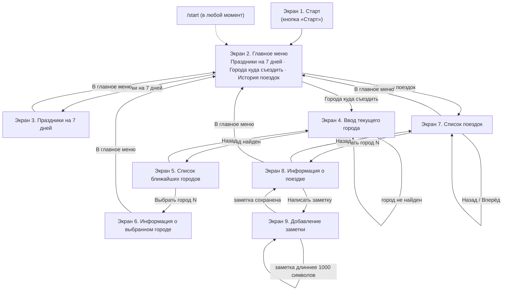
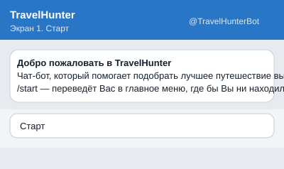
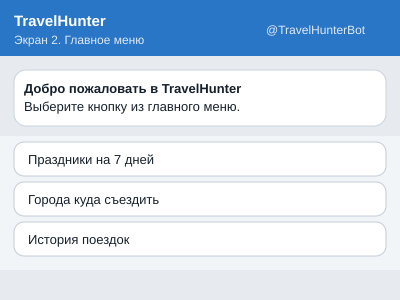
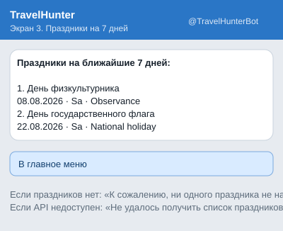
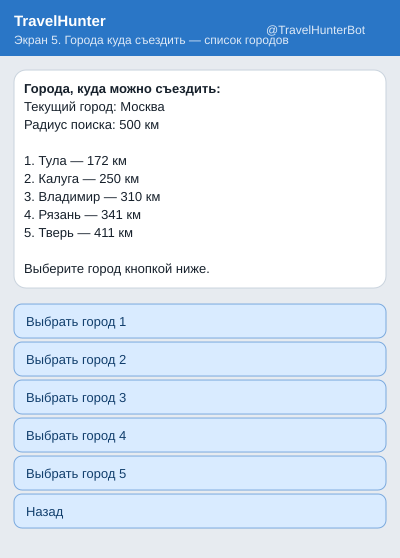
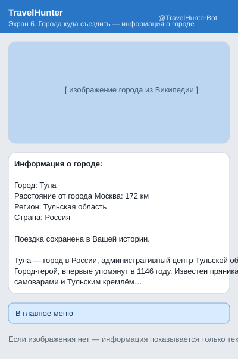
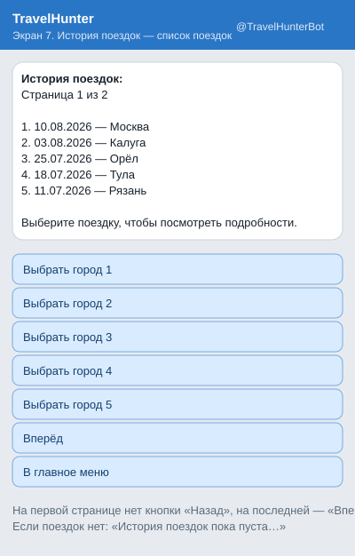
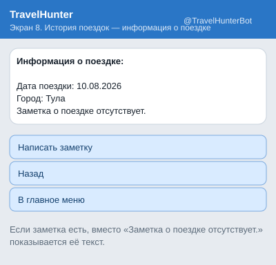

# 04. Карта перемещения пользователя и описание экранов

## Карта перемещения



Диаграмма в формате DrawIO: [diagrams/screens_flow.drawio](diagrams/screens_flow.drawio).

Мокапы экранов (SVG) лежат в папке [mockups/](mockups/) и генерируются из реальных
текстов и кнопок бота командой `python -m scripts.generate_mockups`.

Команда `/start` возвращает пользователя в главное меню независимо от того,
на каком экране он находится. При самом первом обращении к боту показывается
Экран 1 «Старт».

---

## Экран 1. Старт



*Файл: `travelhunter/presentation/screens/start_menu.py` → `StartScreen`*

Показывается при первом открытии бота.

**Текст сообщения:**

```
Добро пожаловать в TravelHunter
Чат-бот, который помогает подобрать лучшее путешествие выходного дня.
/start — переведёт Вас в главное меню, где бы Вы ни находились.
```

**Кнопки (reply-клавиатура):** `Старт` → переход на Экран 2.

---

## Экран 2. Главное меню



*Файл: `start_menu.py` → `MainMenuScreen`*

**Текст сообщения:**

```
Добро пожаловать в TravelHunter
Выберите кнопку из главного меню.
```

**Кнопки (reply-клавиатура):**

| Кнопка | Переход |
|--------|---------|
| Праздники на 7 дней | Экран 3 |
| Города куда съездить | Экран 4 |
| История поездок | Экран 7 |

**Обработка неправильного ввода:**

* текстовое сообщение, не совпадающее с кнопками меню →
  «Нераспознанная команда. Пожалуйста, нажмите выбранную кнопку в меню.»;
* изображение, файл, голосовое сообщение, видео и другие неподдерживаемые типы →
  бот игнорирует сообщение и не выполняет никаких действий
  (`BotHandlers.on_unsupported`).

---

## Экран 3. Праздники на 7 дней



*Файл: `screens/holidays.py` → `HolidaysScreen`; логика: `HolidayService`*

Бот получает праздники страны `RU` из Ninjas Holidays API, оставляет праздники
в диапазоне от текущей даты до текущей даты + 7 дней и показывает максимум 5 штук.

**Формат вывода:**

```
Праздники на ближайшие 7 дней:

1. День физкультурника
   08.08.2026 · Sa · Observance
2. День государственного флага
   22.08.2026 · Sa · National holiday
```

| Ситуация | Поведение |
|----------|-----------|
| Найдено больше 5 праздников | показываются первые 5 |
| Найдено меньше 5 праздников | показываются все найденные |
| Праздники не найдены | «К сожалению, ни одного праздника не найдено. Рекомендуем придумать себе праздник самостоятельно.» |
| API недоступен или вернул некорректный ответ | «Не удалось получить список праздников. Попробуйте ещё раз позже.» |

**Кнопки (inline):** `В главное меню` → Экран 2.

---

## Экран 4. Города куда съездить — ввод города


*Файл: `screens/cities.py` → `CityInputScreen`; логика: `CityService.find_city()`*

**Текст сообщения:**

```
Введите название города, в котором Вы сейчас находитесь.
```

Бот проверяет существование города через GeoNames `searchJSON` и сохраняет
название, широту (`lat`) и долготу (`lng`) в состоянии пользователя.

Пока выполняется запрос к внешнему API, пользователь видит промежуточное
сообщение «Ищу город, подождите, пожалуйста…».

| Ситуация | Поведение |
|----------|-----------|
| Город найден | переход на Экран 5 |
| Город не найден | «Город не найден. Проверьте название города и попробуйте ещё раз.» + повторный ввод |
| GeoNames недоступен | «Не удалось найти город. Попробуйте ещё раз позже.» + кнопка «В главное меню» |

---

## Экран 5. Города куда съездить — список ближайших городов



*Файл: `cities.py` → `NearbyCitiesScreen`; логика: `CityService.find_nearby_cities()`*

Бот получает населённые пункты в радиусе 500 км от города пользователя
(GeoNames `findNearbyPlaceNameJSON`), исключает город пользователя и дубликаты,
сортирует по расстоянию и берёт первые 5.

**Формат вывода:**

```
Города, куда можно съездить:
Текущий город: Москва
Радиус поиска: 500 км

1. Тула — 172 км
2. Калуга — 250 км
3. Владимир — 310 км
4. Рязань — 341 км
5. Тверь — 411 км

Выберите город кнопкой ниже.
```

**Кнопки (inline):** `Выбрать город 1` … `Выбрать город 5`, `Назад`.

| Кнопка | Поведение |
|--------|-----------|
| Выбрать город N | создаётся запись о поездке (`tg_user_id`, `name`, `arrival_date` = текущая дата) → переход на Экран 6 |
| Назад | возврат на Экран 4 |

| Ситуация | Поведение |
|----------|-----------|
| Рядом нет других городов | «К сожалению, рядом с городом «X» не найдено других городов в радиусе 500 км.» + «В главное меню» |
| GeoNames недоступен | «Не удалось найти город. Попробуйте ещё раз позже.» + «В главное меню» |

---

## Экран 6. Города куда съездить — информация о городе



*Файл: `cities.py` → `CityInfoScreen`; логика: `TripService.create_trip()` + `CityService.get_city_info()`*

Пользователю показываются **изображение города**, **название города** и
**краткое описание города** (Wikipedia API: `extracts` + `pageimages`).

**Формат подписи к изображению:**

```
Информация о городе:

Город: Тула
Расстояние от города Москва: 172 км
Регион: Тульская область
Страна: Россия

Поездка сохранена в Вашей истории.

Тула — город в России, административный центр Тульской области. Город-герой…
```

| Ситуация | Поведение |
|----------|-----------|
| Изображение отсутствует | информация показывается текстом, без изображения |
| Telegram не смог отправить изображение | автоматически отправляется текстовое сообщение |
| Информация не получена | сообщение об ошибке + кнопка «В главное меню» (поездка при этом уже сохранена) |

**Кнопки (inline):** `В главное меню` → Экран 2.

---

## Экран 7. История поездок — список моих поездок



*Файл: `screens/history.py` → `HistoryScreen`; логика: `TripService.get_history()`*

Бот получает из базы данных поездки текущего пользователя (`tg_user_id`),
сортирует их от новых к старым и показывает максимум 5 на странице.

**Формат вывода:**

```
История поездок:
Страница 1 из 2

1. 10.08.2026 — Москва
2. 03.08.2026 — Калуга
3. 25.07.2026 — Орёл

Выберите поездку, чтобы посмотреть подробности.
```

**Кнопки (inline):** `Выбрать город 1` … `Выбрать город N` (по числу поездок на странице),
`Назад`, `Вперёд`, `В главное меню`.

| Ситуация | Поведение |
|----------|-----------|
| Поездок больше 5 | пагинация: на первой странице нет кнопки «Назад», на последней — «Вперёд» |
| История пуста | «История поездок пока пуста. Выберите город для своей первой поездки.» и только кнопка «В главное меню» |

---

## Экран 8. История поездок — информация о поездке



*Файл: `history.py` → `TripInfoScreen`; логика: `TripService.get_trip()`*

**Формат вывода:**

```
Информация о поездке:

Дата поездки: 10.08.2026
Город: Тула
Заметка: Были в Туле, гуляли по набережной.
```

Если заметки нет, вместо неё показывается: `Заметка о поездке отсутствует.`

**Кнопки (inline):**

| Кнопка | Переход |
|--------|---------|
| Написать заметку | Экран 9 |
| Назад | Экран 7 (на ту же страницу истории) |
| В главное меню | Экран 2 |

---

## Экран 9. История поездок — добавление заметки


*Файл: `history.py` → `NoteInputScreen`; логика: `TripService.add_note()`*

**Текст сообщения:**

```
Введите текст вашей заметки.
```

Максимальная длина заметки — **1000 символов**.

| Ситуация | Поведение |
|----------|-----------|
| Заметка сохранена | «Заметка успешно сохранена.» → возврат на Экран 8 с сохранённой заметкой |
| Длина больше 1000 символов | «Заметка не должна превышать 1000 символов. Сократите текст и попробуйте ещё раз.» → ожидание повторного ввода |
| Пустой текст | «Заметка не может быть пустой. Введите текст заметки.» → ожидание повторного ввода |

---

## Соответствие экранов и кода

| Экран | Класс экрана | Сервис бизнес-логики | Источник данных |
|-------|--------------|----------------------|-----------------|
| 1. Старт | `StartScreen` | — | — |
| 2. Главное меню | `MainMenuScreen` | — | — |
| 3. Праздники | `HolidaysScreen` | `HolidayService` | Ninjas Holidays API |
| 4. Ввод города | `CityInputScreen` | `CityService.find_city` | GeoNames `searchJSON` |
| 5. Ближайшие города | `NearbyCitiesScreen` | `CityService.find_nearby_cities` | GeoNames `findNearbyPlaceNameJSON` |
| 6. Информация о городе | `CityInfoScreen` | `TripService.create_trip`, `CityService.get_city_info` | PostgreSQL + Wikipedia API |
| 7. История поездок | `HistoryScreen` | `TripService.get_history` | PostgreSQL |
| 8. Информация о поездке | `TripInfoScreen` | `TripService.get_trip` | PostgreSQL |
| 9. Добавление заметки | `NoteInputScreen` | `TripService.add_note` | PostgreSQL |

Состояния пользователя, которые хранятся между экранами, описаны в
`travelhunter/presentation/state.py` (классы `Screen`, `UserContext`, `StateStorage`).
