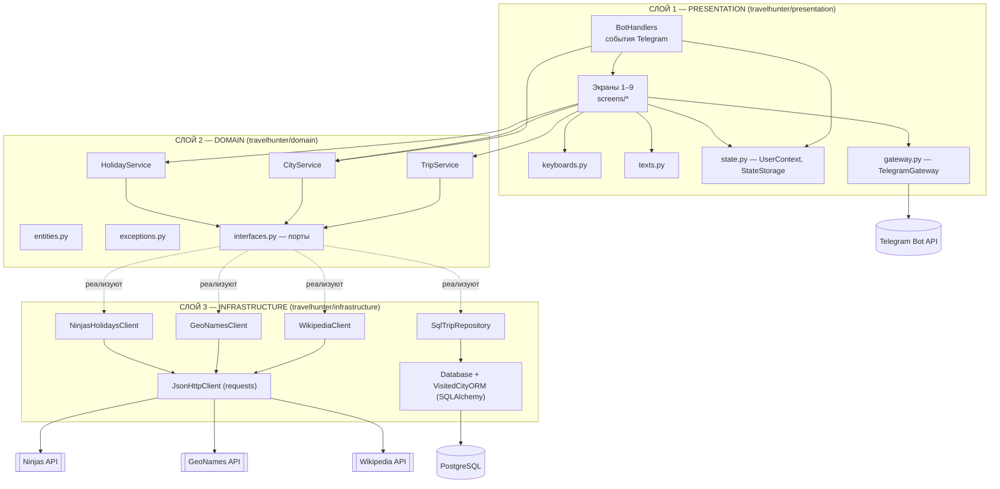
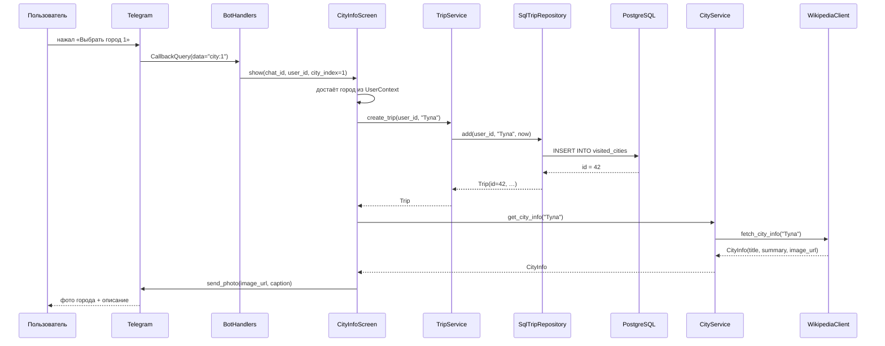

# 05. Архитектура проекта

## Принципы

1. **Трёхслойная архитектура** — представление, бизнес-логика, инфраструктура.
2. **ООП-стиль** — каждый слой состоит из классов с одной зоной ответственности;
   поведение наследуется от абстрактных базовых классов (`abc.ABC`).
3. **Инверсия зависимостей** — бизнес-логика объявляет интерфейсы (порты),
   а инфраструктура их реализует (адаптеры).
4. **Внедрение зависимостей через конструктор** — глобальных переменных и
   «импортов ради side-effect» нет; все объекты собираются в `travelhunter/app.py`.
5. **Единая обработка ошибок** — доменные исключения содержат готовый текст
   для пользователя; обработчики Telegram перехватывают любые ошибки.

## Схема слоёв

Стрелки показывают направление зависимостей: **presentation → domain ← infrastructure**.
Доменный слой не импортирует ни `telebot`, ни `sqlalchemy`, ни `requests`.

## Состав слоёв

### Слой 1. Presentation — «что видит пользователь»

| Модуль | Класс / функции | Ответственность |
|--------|-----------------|-----------------|
| `handlers.py` | `BotHandlers`, декоратор `safe_handler` | приём событий Telegram (команда, кнопка, текст, unsupported-типы), маршрутизация к экранам, перехват всех ошибок |
| `gateway.py` | `TelegramGateway` | единственная точка отправки сообщений и фото; ошибки Telegram API логируются и не «роняют» бота |
| `keyboards.py` | `ButtonText`, `CallbackAction`, `parse_callback`, фабрики клавиатур | reply- и inline-клавиатуры, формат callback-данных |
| `texts.py` | константы и функции `format_*` | все тексты бота и их форматирование |
| `state.py` | `Screen`, `UserContext`, `StateStorage` | конечный автомат диалога: какой экран сейчас, выбранный город, список городов, страница истории, id поездки |
| `screens/*` | `StartScreen`, `MainMenuScreen`, `HolidaysScreen`, `CityInputScreen`, `NearbyCitiesScreen`, `CityInfoScreen`, `HistoryScreen`, `TripInfoScreen`, `NoteInputScreen` | по одному классу на экран из карты перемещения |

### Слой 2. Domain — «правила предметной области»

| Модуль | Содержание |
|--------|------------|
| `entities.py` | `Holiday`, `City`, `NearbyCity`, `CityInfo`, `Trip`, `TripPage` — неизменяемые dataclass-сущности |
| `exceptions.py` | `TravelHunterError` и наследники: `ConfigError`, `ExternalServiceError`, `HolidaysUnavailableError`, `CitySearchUnavailableError`, `CityInfoUnavailableError`, `CityNotFoundError`, `NearbyCitiesNotFoundError`, `DatabaseError`, `TripNotFoundError`, `NoteTooLongError`, `EmptyNoteError`, `InvalidStateError`. У каждого есть `user_message` |
| `interfaces.py` | порты: `HolidaysProvider`, `CityProvider`, `CityInfoProvider`, `TripRepository` |
| `services/holiday_service.py` | окно в 7 дней, сортировка по дате, лимит 5 праздников, запрос двух годов на стыке лет |
| `services/city_service.py` | поиск города, исключение города пользователя и дубликатов, сортировка по расстоянию, лимит 5, обрезка описания города |
| `services/trip_service.py` | создание поездки, история с пагинацией, проверка владельца поездки, валидация заметки (≤ 1000 символов, непустая) |

### Слой 3. Infrastructure — «как данные приходят и хранятся»

| Модуль | Содержание |
|--------|------------|
| `api/http_client.py` | `JsonHttpClient` — общий GET-запрос: таймаут, ошибки соединения, HTTP-статусы, разбор JSON |
| `api/ninjas_client.py` | `NinjasHolidaysClient` — `GET /v2/holidays`, заголовок `X-Api-Key`, разбор дат в разных форматах |
| `api/geonames_client.py` | `GeoNamesClient` — `searchJSON` и `findNearbyPlaceNameJSON`, выбор города с наибольшим населением, обработка ошибок аккаунта GeoNames |
| `api/wikipedia_client.py` | `WikipediaClient` — MediaWiki Action API: `prop=extracts|pageimages`, перенаправления, миниатюра изображения |
| `db/database.py` | `Database` — движок SQLAlchemy, фабрика сессий, контекст `session_scope()` с commit/rollback, `create_all()` |
| `db/models.py` | `Base`, `VisitedCityORM` — таблица `visited_cities` |
| `db/repositories.py` | `SqlTripRepository` — реализация порта `TripRepository`; преобразование ORM → доменная сущность `Trip` |

### Сквозные модули

| Модуль | Содержание |
|--------|------------|
| `config.py` | `Settings` — чтение настроек из `.env`/переменных окружения, валидация, предупреждения о незаполненных ключах |
| `app.py` | `Application` — композиционный корень: создаёт инфраструктуру, сервисы, экраны и обработчики; `main()` — запуск бота |

## Поток данных на примере «Выбрать город для поездки»

## Почему выбраны такие решения

| Решение | Обоснование |
|---------|-------------|
| Интерфейсы в доменном слое | сервисы можно тестировать на фейках; базу можно заменить (PostgreSQL → SQLite) без изменения бизнес-логики |
| Состояние пользователя в памяти (`StateStorage`) | не требуется Redis; данные диалога живут между экранами; хранилище потокобезопасно (`threading.RLock`), так как telebot обрабатывает апдейты в пуле потоков |
| Сущности отдельны от ORM-моделей | бизнес-логика не зависит от схемы базы и от «ленивой загрузки» SQLAlchemy |
| Все тексты в `texts.py` | легко сверять формулировки с техническим заданием |
| Единый `JsonHttpClient` | одинаковая обработка сетевых ошибок для всех трёх внешних API |
| `Settings` как неизменяемый dataclass | настройки читаются один раз при старте и не могут «испортиться» в процессе работы |
